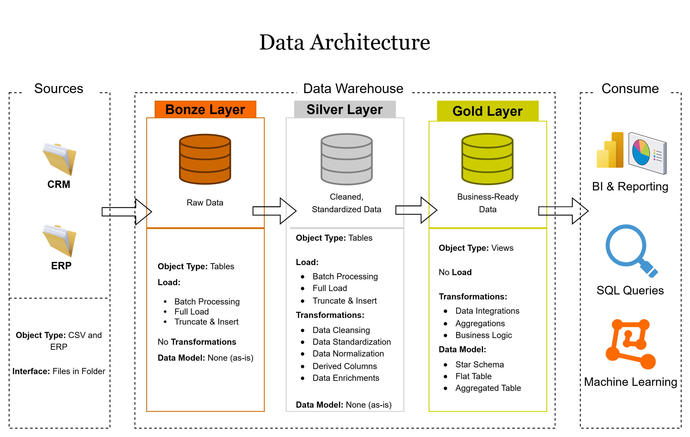
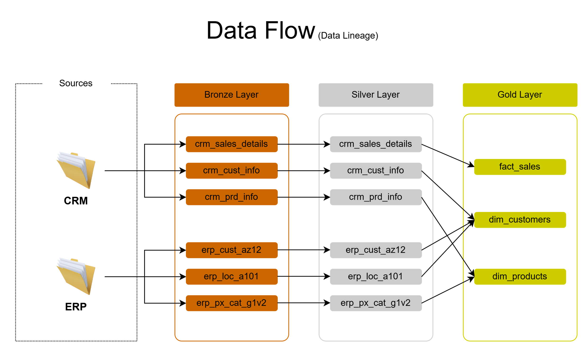
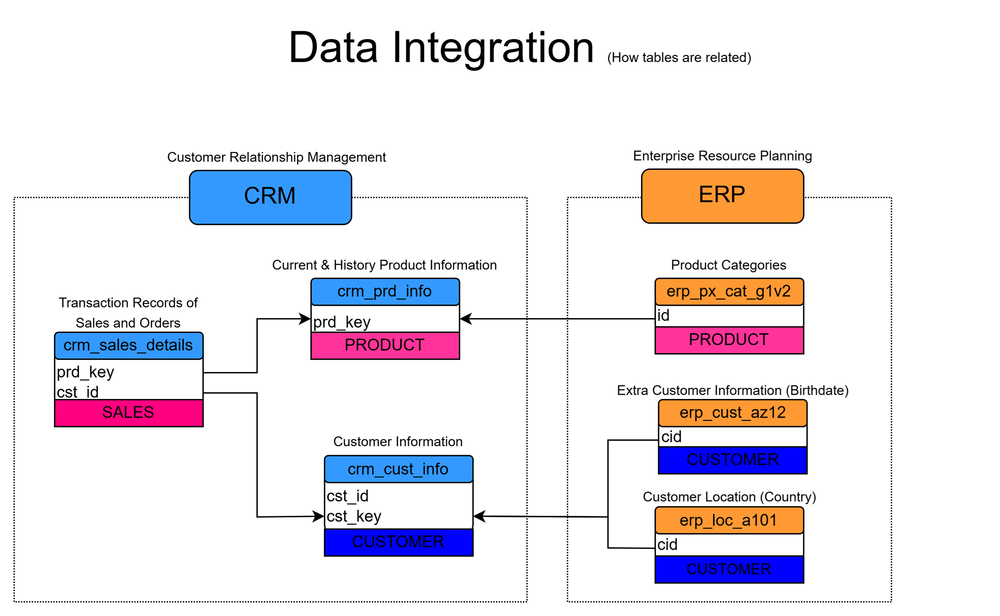
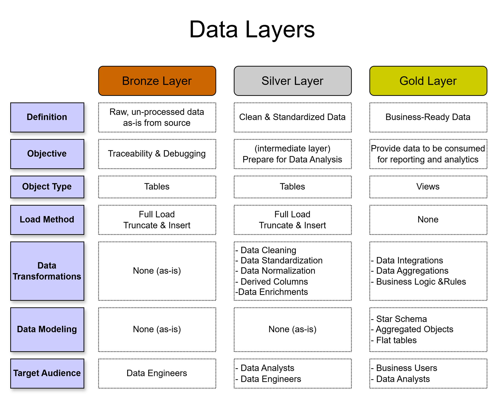
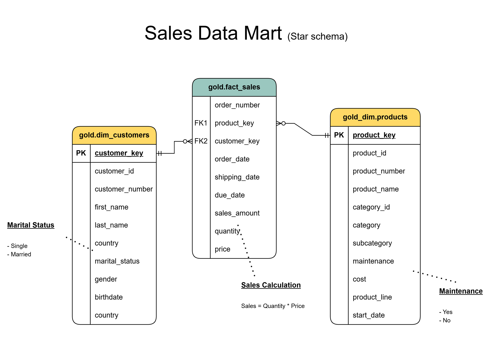

# 🗄️ SQL Data Warehouse Project
> Designing and building a modern Data Warehouse using **SQL Server** with the **Medallion Architecture** (Bronze → Silver → Gold), covering ETL processes, data modeling, and analytics-ready outputs.

---

## 📖 Project Overview

This project demonstrates the end-to-end design and implementation of a data warehouse built on **Microsoft SQL Server**. Raw data from two source systems — a **CRM** and an **ERP** — is ingested, cleaned, transformed, and modeled into a **Star Schema** ready for BI reporting and analytics.

The project follows the **Medallion Architecture**, a layered approach that ensures data traceability, quality, and business readiness at each stage of the pipeline.

---

## 🏗️ Data Architecture

The warehouse is structured into three distinct layers:



| Layer | Description | Object Type | Load Method |
|---|---|---|---|
| 🟤 **Bronze** | Raw, unprocessed data ingested as-is from source | Tables | Full Load · Truncate & Insert |
| ⚪ **Silver** | Cleaned, standardized, and normalized data | Tables | Full Load · Truncate & Insert |
| 🟡 **Gold** | Business-ready data modeled for consumption | Views | None (query-time) |

---

## 🔄 Data Flow (Lineage)

The diagram below shows how data moves from source systems through each layer of the warehouse.



**Sources → Bronze → Silver → Gold**

| Source | Bronze Tables | Silver Tables | Gold Objects |
|---|---|---|---|
| CRM | `crm_sales_details` | `crm_sales_details` | `fact_sales` |
| CRM | `crm_cust_info` | `crm_cust_info` | `dim_customers` |
| CRM | `crm_prd_info` | `crm_prd_info` | `dim_products` |
| ERP | `erp_cust_az12` | `erp_cust_az12` | `dim_customers` |
| ERP | `erp_loc_a101` | `erp_loc_a101` | `dim_customers` |
| ERP | `erp_px_cat_g1v2` | `erp_px_cat_g1v2` | `dim_products` |

---

## 🔗 Data Integration

The diagram below shows how source tables from CRM and ERP are related and joined across the warehouse.



- `crm_sales_details` links to `crm_prd_info` via `prd_key` and to `crm_cust_info` via `cst_id`
- `crm_cust_info` is enriched with ERP data from `erp_cust_az12` (birthdate) and `erp_loc_a101` (country) via `cid`
- `crm_prd_info` is enriched with product categories from `erp_px_cat_g1v2` via `PRODUCT`

---

## 📐 Data Layers — Detailed Breakdown



### 🟤 Bronze Layer
- **Definition:** Raw data loaded as-is from source files (CSV / ERP system)
- **Objective:** Preserve source data for traceability and debugging
- **Transformations:** None
- **Target Audience:** Data Engineers

### ⚪ Silver Layer
- **Definition:** Cleaned and standardized data ready for analysis
- **Objective:** Intermediate layer that prepares data for the Gold layer
- **Transformations:** Data Cleansing · Standardization · Normalization · Derived Columns · Data Enrichments
- **Target Audience:** Data Engineers · Data Analysts

### 🟡 Gold Layer
- **Definition:** Business-ready data modeled into a Star Schema
- **Objective:** Serve reporting, analytics, and machine learning use cases
- **Transformations:** Data Integrations · Aggregations · Business Logic & Rules
- **Data Models:** Star Schema · Flat Tables · Aggregated Objects
- **Target Audience:** Business Users · Data Analysts

---

## ⭐ Data Model — Sales Data Mart (Star Schema)

The Gold layer exposes a **Sales Data Mart** built on a Star Schema with one fact table and two dimension tables.



### `gold.fact_sales`
Central fact table capturing sales transactions.

| Column | Description |
|---|---|
| `order_number` | Unique order identifier |
| `product_key` (FK) | Links to `dim_products` |
| `customer_key` (FK) | Links to `dim_customers` |
| `order_date` | Date order was placed |
| `shipping_date` | Date order was shipped |
| `due_date` | Expected delivery date |
| `sales_amount` | Calculated as `quantity × price` |
| `quantity` | Number of units ordered |
| `price` | Unit price |

### `gold.dim_customers`
Customer dimension enriched from CRM and ERP sources.

| Column | Description |
|---|---|
| `customer_key` (PK) | Surrogate key |
| `customer_id` | Source system ID |
| `customer_number` | Business customer number |
| `first_name` / `last_name` | Customer name |
| `country` | Customer location (from ERP) |
| `marital_status` | Single / Married |
| `gender` | Customer gender |
| `birthdate` | Date of birth (from ERP) |

### `gold.dim_products`
Product dimension enriched with category data from ERP.

| Column | Description |
|---|---|
| `product_key` (PK) | Surrogate key |
| `product_id` | Source system ID |
| `product_number` | Business product number |
| `product_name` | Product display name |
| `category_id` | Category identifier |
| `category` / `subcategory` | Product classification |
| `product_line` | Product line grouping |
| `cost` | Product cost |
| `maintenance` | Yes / No |
| `start_date` | Product availability start |

---

## 🛠️ Tech Stack


- **Database:** Microsoft SQL Server
- **Language:** T-SQL
- **Architecture:** Medallion (Bronze / Silver / Gold)
- **Data Modeling:** Star Schema
- **Diagramming:** Draw.io

---

## 📁 Repository Structure

```
SQL_Data_Warehouse_Project/
│
├── datasets/               # Source CSV files (CRM & ERP)
├── docs/                   # Architecture and model diagrams
│   ├── Data_Architecture.png
│   ├── Data_Flow.png
│   ├── Data_Integration.png
│   ├── Data_Layers.png
│   └── Data_Model.png
├── scripts/
│   ├── bronze/             # DDL & load scripts for Bronze layer
│   ├── silver/             # Transformation scripts for Silver layer
│   └── gold/               # View definitions for Gold layer
└── README.md
```

---

## 🚀 What's Next

- [ ] Rebuild this project on **Databricks** using the same Medallion Architecture
- [ ] Add orchestration with **Apache Airflow**
- [ ] Explore **dbt** for transformation layer management

---

## 🙏 Acknowledgements

This project was built following the guidance of **[Baraa Khatib Salkini](https://www.youtube.com/@datawithbaraa)** as part of his SQL Data Warehouse course. Highly recommended for anyone looking to learn practical data engineering.

---

## 📬 Connect with Me

[](https://www.linkedin.com/in/mark-anthony-baltazar-305364a0/)
[](https://github.com/mabaltazar)
